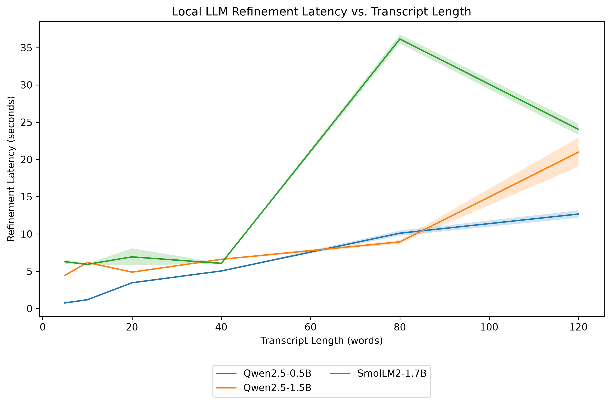

# Jeeves

Jeeves is a fully local Windows speech-to-LLM pipeline built around continuous microphone input, voice-activity detection, Whisper speech recognition, Qwen2.5-1.5B transcription refinement, and a downstream LLM agent.

The purpose of Jeeves is to provide a clean speech interface for another local AI agent. Speech is captured continuously from the microphone, segmented into complete utterances using Silero VAD, transcribed using `faster-whisper`, checked for the activation keyword `Jeeves`, refined by Qwen2.5-1.5B-Instruct, and then passed to a downstream agent interface.

The important architectural principle is that each component has a single responsibility. Whisper performs speech recognition; it does not decide what the user wants. Qwen performs linguistic cleanup; it does not execute commands or answer questions. The downstream agent receives the resulting text and is responsible for reasoning and taking action.

The purpose of this codebase is to provide a proof of concept. The current setup of Whisper with `small` setting is to reduce the workload, leading to less than optimal capabilities in speech-to-text translation. Similarly, the use of the `Qwen2.5-1.5B-Instruct1` is meant to be used as the proof of concept of the validity of this pipeline.

---

## Architecture

The current pipeline is:

```text
                         MICROPHONE
                             │
                             ▼
                  ┌─────────────────────┐
                  │ Continuous Audio    │
                  │ Capture              │
                  │ 16 kHz / mono       │
                  └──────────┬──────────┘
                             │
                             ▼
                  ┌─────────────────────┐
                  │ Silero VAD          │
                  │                     │
                  │ Speech segmentation │
                  └──────────┬──────────┘
                             │
                     complete utterance
                             │
                             ▼
                  ┌─────────────────────┐
                  │ faster-whisper      │
                  │                     │
                  │ Speech → text       │
                  └──────────┬──────────┘
                             │
                       raw transcript
                             │
                             ▼
                  ┌─────────────────────┐
                  │ Wake-word routing   │
                  │                     │
                  │ "Jeeves" present?   │
                  └──────────┬──────────┘
                             │
                            YES
                             │
                             ▼
                  ┌─────────────────────┐
                  │ Qwen2.5-1.5B        │
                  │ Instruct            │
                  │                     │
                  │ Text refinement      │
                  └──────────┬──────────┘
                             │
                      refined transcript
                             │
                             ▼
                  ┌─────────────────────┐
                  │ Downstream Agent    │
                  └─────────────────────┘
```

The microphone is never stopped while the system is running. Audio is collected continuously in a background stream. Silero VAD determines when speech begins and ends, and a pre-roll buffer preserves a small amount of audio before VAD detects the start of speech.

Whisper receives the resulting complete utterance rather than arbitrary fixed-duration microphone windows. This is important for transcription quality because speech is not naturally divided into 2-second or 3-second chunks.

---

## Current wake-word design

The current version does not use a dedicated wake-word neural network.

Instead, every completed speech utterance is sent to Whisper, and the resulting transcription is checked for the word:

```text
jeeves
```

For example:

```text
User:
    "Jeeves, move the second Unit behind the building."

Whisper:
    "Jeeves, move the second Unit behind the building."

Wake-word router:
    Jeeves detected

Command:
    "Move the second Unit behind the building."

Qwen:
    "Move the second Unit behind the building."

Agent:
    receives refined command
```

An utterance that does not contain the activation keyword is ignored.

For example:

```text
User:
    "What is the weather tomorrow?"

Whisper:
    "What is the weather tomorrow?"

Wake-word router:
    No Jeeves keyword

Result:
    ignored
```

This architecture is intentionally simple and prioritizes high-quality speech recognition while the rest of the pipeline is being developed.

A future version can replace this routing mechanism with a dedicated lightweight wake-word detector. That will allow Whisper to run only after the wake word is detected and will substantially reduce CPU usage.

---

# Requirements

## Operating system

The current implementation targets:

* Windows 10 or Windows 11
* 64-bit Python
* MicroConda or Miniconda
* A working microphone

Windows is the primary target because the project is intended to run as a local desktop voice interface.

---

## Python

Python 3.11 is recommended.

Create the environment with:

```powershell
conda create -n voice-agent python=3.11 -y
```

Activate it:

```powershell
conda activate voice-agent
```

Verify:

```powershell
python --version
```

Expected:

```text
Python 3.11.x
```

---

# Installation

## 1. Create the environment

Open PowerShell or an Anaconda/MicroConda terminal:

```powershell
conda create -n voice-agent python=3.11 -y
```

Activate it:

```powershell
conda activate voice-agent
```

Upgrade the Python packaging tools:

```powershell
python -m pip install --upgrade pip setuptools wheel
```

---

## 2. Install PyTorch

For a CPU-only installation:

```powershell
pip install torch torchvision torchaudio
```

Verify the installation:

```powershell
python -c "import torch; print(torch.__version__); print('CUDA:', torch.cuda.is_available())"
```

For a CUDA-capable NVIDIA system, install the appropriate PyTorch CUDA build instead of blindly using the CPU configuration above.

The appropriate PyTorch build depends on the GPU and currently supported CUDA version.

---

## 3. Install Jeeves dependencies

Install the Python dependencies:

```powershell
pip install -r requirements.txt
```

The major components are:

```text
faster-whisper
Silero VAD
Transformers
Qwen2.5-1.5B-Instruct
sounddevice
NumPy
PyTorch
```

---

# Project structure

The project should look like:

```text
jeeves/
│
├── README.md
├── requirements.txt
├── main.py
├── config.py
│
├── audio/
│   ├── __init__.py
│   └── recorder.py
│
├── speech/
│   ├── __init__.py
│   └── whisper.py
│
├── llm/
│   ├── __init__.py
│   └── refiner.py
│
└── agent/
    ├── __init__.py
    └── interface.py
```

---

# Components

## Audio capture

`audio/recorder.py`

The audio subsystem uses `sounddevice` to maintain a continuous microphone stream.

The microphone is configured as:

```text
Sample rate: 16000 Hz
Channels:    1
Format:      float32
```

Audio blocks are placed into a queue from the sounddevice callback. The callback performs almost no computation so that model inference cannot block the audio stream.

A worker thread consumes the audio queue and performs VAD processing.

---

## Silero VAD

Silero VAD determines whether the incoming audio contains speech.

The system maintains a small pre-roll buffer:

```text
                 microphone
                     │
                     ▼
              audio frames
                     │
                     ▼
              ┌─────────────┐
              │ 500 ms      │
              │ pre-roll    │
              └─────────────┘
                     │
                     ▼
                 Silero VAD
```

When VAD detects the beginning of speech, the pre-roll audio is attached to the utterance.

This prevents the beginning of a sentence from being lost due to VAD detection latency.

When VAD detects sustained silence, the complete utterance is placed into a queue for transcription.

---

## Whisper

The project uses `faster-whisper`.

The default model is:

```text
base
```

The model can be changed in `config.py`.

For example:

```python
WHISPER_MODEL = "small"
```

Possible models include:

```text
tiny
base
small
medium
large-v3
```

Larger models generally provide better recognition at the cost of substantially greater compute and memory requirements.

For CPU systems, start with:

```python
WHISPER_MODEL = "base"
```

If transcription quality is insufficient and the hardware can handle it:

```python
WHISPER_MODEL = "small"
```

---

# Qwen refinement

The project uses:

```text
Qwen/Qwen2.5-1.5B-Instruct
```

Qwen receives the raw Whisper transcription and performs constrained cleanup.

Its instructions are intentionally restrictive.

Qwen is expected to:

* correct obvious ASR mistakes
* correct punctuation
* correct capitalization
* correct obvious grammar
* remove unnecessary verbal fillers
* remove obvious accidental repetitions

Qwen must not:

* answer questions
* execute commands
* invent information
* summarize the user
* expand the user's request
* change the intended meaning

For example:

```text
Whisper:

"jeeves move the Unit uh to the left side of the building"
```

Qwen should produce approximately:

```text
Move the Unit to the left side of the building.
```

It should not produce:

```text
The Unit has been moved to the left side of the building.
```

The latter would be an action or interpretation rather than transcription refinement.

---

# Why retain the raw transcript?

The system deliberately retains both:

```text
raw_transcript
```

and:

```text
refined_text
```

This is important for debugging and future evaluation.

If an agent performs an incorrect action, the pipeline can be inspected:

```text
Audio
  ↓
Whisper
  ↓
raw_transcript
  ↓
Qwen
  ↓
refined_text
  ↓
Agent
```

This allows errors to be attributed to the appropriate component.

For example:

```text
Audio:
    "Move Unit 2 to B17."

Whisper:
    "Move Unit 2 to B17."

Qwen:
    "Move Unit 2 to B17."

Agent:
    incorrect action
```

This indicates an agent-level problem rather than an ASR problem.

---

# Configuration

All major settings are located in:

```text
config.py
```

## Wake word

```python
WAKE_WORD = "jeeves"
```

Change this to another keyword if desired:

```python
WAKE_WORD = "computer"
```

The current matching is case-insensitive.

---

## Audio

```python
SAMPLE_RATE = 16000
CHANNELS = 1
AUDIO_BLOCK_SIZE = 512
```

16 kHz mono is appropriate for the speech-recognition pipeline.

At 16 kHz:

```text
512 samples ≈ 32 ms
```

This gives reasonably low VAD latency without creating excessive callback overhead.

---

## VAD

```python
VAD_THRESHOLD = 0.5
VAD_MIN_SILENCE_MS = 700
VAD_SPEECH_PAD_MS = 120
PRE_ROLL_MS = 500
```

If Jeeves frequently cuts off the beginning of speech, increase:

```python
PRE_ROLL_MS
```

For example:

```python
PRE_ROLL_MS = 750
```

If commands terminate too quickly when the user pauses briefly, increase:

```python
VAD_MIN_SILENCE_MS
```

For example:

```python
VAD_MIN_SILENCE_MS = 1000
```

If the system waits too long after the user finishes speaking, decrease it.

---

# Running Jeeves

From the project directory:

```powershell
conda activate voice-agent
python main.py
```

On the first execution, the required models may need to be downloaded.

After initialization, Jeeves will report:

```text
======================================================================
JEEVES READY
======================================================================

Speak normally. Complete utterances will be transcribed automatically.

Activation word: "jeeves"

Press Ctrl+C to exit.
```

Speak naturally.

For example:

```text
Jeeves, move the second Unit behind the building.
```

The expected processing sequence is:

```text
[Speech detected]

[Speech ended]

Transcribing...

WHISPER:
Jeeves, move the second Unit behind the building.

COMMAND:
Move the second Unit behind the building.

Refining...

REFINED:
Move the second Unit behind the building.

DOWNSTREAM AGENT
```

---

# Testing the microphone

If the application cannot access the microphone, enumerate the available audio devices:

```powershell
python -c "import sounddevice as sd; print(sd.query_devices())"
```

This prints the available input and output devices.

You can also run:

```powershell
python -c "import sounddevice as sd; print(sd.default.device)"
```

If the wrong microphone is selected, the audio recorder can later be modified to explicitly select a device.

---

# CPU performance

The current pipeline contains three machine-learning components:

```text
Silero VAD
Whisper
Qwen
```

Silero VAD is comparatively lightweight.

Whisper and Qwen are the major computational costs.

For CPU-only operation, start with:

```python
WHISPER_MODEL = "base"
```

and the standard Qwen2.5-1.5B model.

If inference latency is too high, the first thing to investigate is the Whisper model size.

For example:

```text
tiny
    ↓
base
    ↓
small
    ↓
medium
    ↓
large-v3
```

The tradeoff is approximately:

```text
smaller model
    =
lower latency
lower memory
lower recognition quality

larger model
    =
higher latency
higher memory
better recognition quality
```

Qwen refinement also adds latency. If the downstream agent is already capable of correcting transcription, Qwen can eventually be made optional.

---

# Current limitations

The current implementation intentionally has several limitations.

## Wake-word detection

Every complete utterance is sent through Whisper before the wake word is checked.

Therefore:

```text
User speaks
    ↓
VAD
    ↓
Whisper
    ↓
wake-word check
```

rather than:

```text
User speaks
    ↓
dedicated wake-word detector
    ↓
Whisper only after Jeeves
```

This is simple and gives us a high-quality ASR baseline, but it is not the most computationally efficient design.

---

## No streaming Whisper transcription

Whisper currently processes a complete utterance after VAD determines that the user has stopped speaking.

This means the system does not currently display partial transcription while the user is speaking.

This is intentional.

For an agent interface, complete-utterance transcription provides a much cleaner boundary:

```text
speech begins
      ↓
speech continues
      ↓
speech ends
      ↓
Whisper
      ↓
final transcript
```

A future version can add streaming or speculative transcription if lower perceived latency becomes important.

---

## Qwen is not an agent

Qwen is strictly a preprocessing component.

The architecture is:

```text
Speech
  ↓
ASR
  ↓
Text normalization
  ↓
Agent
```

not:

```text
Speech
  ↓
ASR
  ↓
Qwen agent
  ↓
Another agent
```

This distinction is important because it prevents the 1.5B model from becoming an unnecessary reasoning bottleneck.

---

# Future architecture

The intended production architecture is:

```text
                         MICROPHONE
                             │
                             ▼
                  ┌─────────────────────┐
                  │ Dedicated Wake Word │
                  │ Detector            │
                  │                     │
                  │       JEEVES        │
                  └──────────┬──────────┘
                             │
                       wake detected
                             │
                             ▼
                  ┌─────────────────────┐
                  │ Silero VAD          │
                  │                     │
                  │ Complete utterance  │
                  └──────────┬──────────┘
                             │
                             ▼
                  ┌─────────────────────┐
                  │ faster-whisper      │
                  │                     │
                  │ High quality ASR    │
                  └──────────┬──────────┘
                             │
                             ▼
                  ┌─────────────────────┐
                  │ Qwen2.5-1.5B        │
                  │                     │
                  │ Conservative        │
                  │ normalization       │
                  └──────────┬──────────┘
                             │
                             ▼
                  ┌─────────────────────┐
                  │ Local Agent API     │
                  └──────────┬──────────┘
                             │
                             ▼
                  ┌─────────────────────┐
                  │ Downstream LLM      │
                  │ Agent               │
                  └─────────────────────┘
```

The dedicated wake-word detector should eventually run continuously at very low computational cost. It should not replace Whisper as the ASR system; it should simply determine when the expensive ASR pipeline needs to activate.

---

# Future agent interface

The current agent interface is deliberately simple:

```python
@dataclass
class AgentInput:

    raw_transcript: str
    refined_text: str
    timestamp: datetime
```

A future implementation can expose this through:

* a Python callback
* an asyncio queue
* localhost HTTP
* WebSocket
* ZeroMQ
* multiprocessing IPC
* a local message bus

For example:

```text
Jeeves
   │
   ▼
AgentInput
   │
   ▼
localhost:8000/agent/input
   │
   ▼
LLM Agent
```

This allows the voice frontend and agent to run as independent processes.

---

# Design philosophy

Jeeves is intentionally designed as a preprocessing pipeline rather than a single monolithic voice assistant.

Each stage should be independently testable:

```text
Microphone
    ↓
Audio
    ↓
VAD
    ↓
Utterance
    ↓
Whisper
    ↓
Raw text
    ↓
Qwen
    ↓
Refined text
    ↓
Agent
```

This separation makes it possible to measure each stage independently.

For example, ASR can be evaluated using word error rate without involving Qwen or the downstream agent. Qwen can be evaluated by comparing raw and refined transcripts. The downstream agent can be evaluated using the refined text while bypassing the speech subsystem entirely.

That separation will also make it much easier to eventually train or evaluate the downstream LLM agent because speech-recognition errors will not be conflated with agent reasoning errors.

---

# Troubleshooting

## Microphone is not detected

Run:

```powershell
python -c "import sounddevice as sd; print(sd.query_devices())"
```

Check that a microphone appears as an input device.

Also verify that Windows has granted Python access to the microphone.

---

## VAD never detects speech

Try lowering:

```python
VAD_THRESHOLD = 0.5
```

to:

```python
VAD_THRESHOLD = 0.3
```

Do not immediately make the threshold extremely low because this can cause background noise to be classified as speech.

---

## VAD cuts speech off too quickly

Increase:

```python
VAD_MIN_SILENCE_MS = 700
```

to:

```python
VAD_MIN_SILENCE_MS = 1000
```

or:

```python
VAD_MIN_SILENCE_MS = 1200
```

---

## First words are clipped

Increase:

```python
PRE_ROLL_MS = 500
```

to:

```python
PRE_ROLL_MS = 750
```

or:

```python
PRE_ROLL_MS = 1000
```

---

## Whisper is too slow

Try:

```python
WHISPER_MODEL = "tiny"
```

or retain:

```python
WHISPER_MODEL = "base"
```

and use a faster CPU configuration.

If an NVIDIA GPU is available, install the appropriate CUDA-enabled PyTorch/CTranslate2 configuration instead.

---

## Qwen is too slow

The current implementation uses standard Transformers inference with the 1.5B model.

Potential future optimizations include:

* quantized Qwen
* GGUF inference
* `llama.cpp`
* reduced context
* shorter generation limits
* keeping the model permanently resident
* GPU inference

The refinement task is small, so Qwen should generally require only a short generation.

---

# Stopping the application

Press:

```text
Ctrl+C
```

The microphone stream will be stopped and the application will exit.

---

## Refiner Evaluation

The language-model refiner was evaluated on a Windows 11 system using
CPU-only inference. The benchmark measures refinement latency across
increasing transcript lengths to characterize the computational cost
introduced by the local LLM stage of the Jeeves pipeline.

**Benchmark hardware:**

- **OS:** Windows 11
- **CPU:** Intel Core i7-7700 @ 3.60 GHz
- **CPU:** 4 physical cores / 8 logical processors
- **RAM:** 32 GB
- **GPU:** None
- **Inference:** CPU only

The benchmark evaluates Qwen2.5-0.5B-Instruct, Qwen2.5-1.5B-Instruct,
and SmolLM2-1.7B-Instruct using transcripts ranging from 5 to 120
words. Each model is evaluated sequentially after a warm-up phase, with
multiple repetitions for each transcript length. Whisper is not included
in this experiment; the benchmark isolates the additional computational
cost of the language-model refinement stage.

### Refinement Latency



The figure shows refinement latency as a function of transcript length
for the evaluated local language models. Error bars represent the
standard deviation across repeated measurements. This experiment is
intended to characterize the latency-quality tradeoff involved in
adding local language-model refinement to an interactive speech
pipeline rather than provide a general benchmark of language-model
performance.

---
## Development Note

This project was developed as a rapid prototype over approximately
three hours. ChatGPT was used as an AI programming assistant for
implementation support, debugging, documentation, and exploration of
alternative model configurations. The system architecture,
experimental design, model selection, and evaluation methodology were
reviewed and validated by the author.

---

# License

This project is a local experimental voice-agent frontend. Individual dependencies retain their own licenses.

Check the licenses of:

* PyTorch
* faster-whisper
* CTranslate2
* Silero VAD
* Transformers
* Qwen2.5
* NumPy
* sounddevice

before redistributing the complete application.
